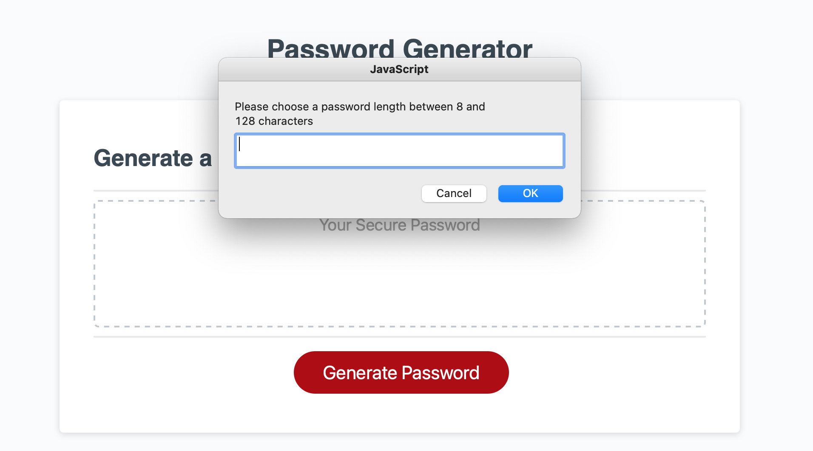
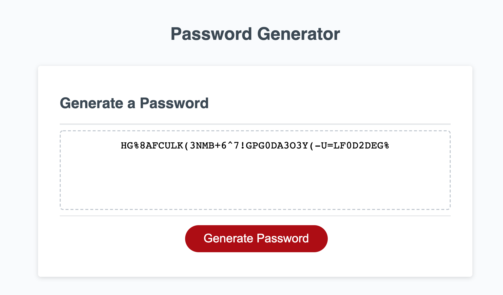

# Password Generator

## Description:

The following page displays a random password generator. The javascript needed to be manipulated in order to create a random password between 8-128 characters. The user was given choices between including letters (both uppercase and lowercase), numbers and special characters in their random password. In order to accomplish this, I created a function including if/else statements. I utilized the skills learned this past week, including arrays, if/else statements, functions, coditionals, creating variables, and for loops.

## Credit:

Hannah Folk, my tutor, helped with reviewing my code and helped me make necesary changes to adhere to the guidelines in the README file for this assignment. I also utilized youtube to help me.

## Deployed Site:

https://eweagraff.github.io/password_generator/?

## License:

Copyright 2021 Emily Weagraff

Permission is hereby granted, free of charge, to any person obtaining a copy of this software and associated documentation files (the "Software"), to deal in the Software without restriction, including without limitation the rights to use, copy, modify, merge, publish, distribute, sublicense, and/or sell copies of the Software, and to permit persons to whom the Software is furnished to do so, subject to the following conditions:

The above copyright notice and this permission notice shall be included in all copies or substantial portions of the Software.

THE SOFTWARE IS PROVIDED "AS IS", WITHOUT WARRANTY OF ANY KIND, EXPRESS OR IMPLIED, INCLUDING BUT NOT LIMITED TO THE WARRANTIES OF MERCHANTABILITY, FITNESS FOR A PARTICULAR PURPOSE AND NONINFRINGEMENT. IN NO EVENT SHALL THE AUTHORS OR COPYRIGHT HOLDERS BE LIABLE FOR ANY CLAIM, DAMAGES OR OTHER LIABILITY, WHETHER IN AN ACTION OF CONTRACT, TORT OR OTHERWISE, ARISING FROM, OUT OF OR IN CONNECTION WITH THE SOFTWARE OR THE USE OR OTHER DEALINGS IN THE SOFTWARE.
